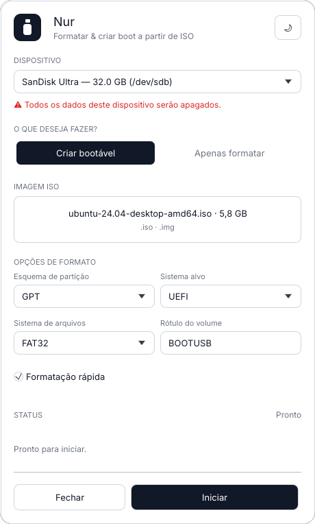
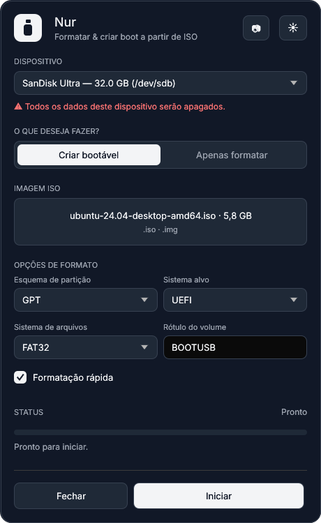

<h1 align="center">Nur · نور</h1>

  <em>"Luz" — <strong>An-Nûr</strong>, um dos nomes de Deus. 
  Dar boot é acender a máquina.</em>

---

**Nur** é um app desktop em **Rust** para **formatar pendrives** e **criar pendrives bootáveis a partir de uma imagem ISO** — com foco em ser **simples, prático e à prova de acidentes** (a operação é destrutiva).

<table>
  <tr>
    <td align="center"> Tema claro</td>
    <td align="center"> Tema escuro</td>
  </tr>
</table>

Tela principal do Nur — temas claro e escuro.

## Características

- 🖥️ **UI nativa** em [egui/eframe](https://github.com/emilk/egui) — painel único, leve e moderno.
- 🌗 **Tema claro/escuro** com persistência.
- 🧠 **Gravador inteligente**: detecta o tipo da ISO e escolhe a técnica (raw write para Linux isohybrid; extração para Windows).
- 🛡️ **Segurança em primeiro lugar**: exclui o disco de sistema, exige confirmação explícita, desmonta antes de gravar.
- 🧩 **Arquitetura hexagonal** (workspace de crates), cross-platform (Linux primeiro; depois Windows e macOS).

## Status

As **Fases 1–5 estão implementadas e mergeadas**; a **Fase 6** (modo Formatar real) está em **PR aberta**.

- ✅ **Fase 1 — Fundação:** workspace hexagonal (`domain`→`application`→`infrastructure`→`app`→`ui`) com lints exigentes e CI/Release.
- ✅ **Fase 2 — UI completa:** egui/eframe fiel ao protótipo (tema claro/escuro, fonte Inter, janela arredondada, modal "digite APAGAR", componentes reutilizáveis).
- ✅ **Fase 3 — Enumeração real (Linux):** descoberta de pendrives via **sysfs** (`/sys/block`) com atualização ao vivo (pivot de udisks2 → sysfs por performance).
- ✅ **Fase 4 — Gravação raw da ISO:** via udisks2/polkit (`Block.OpenDevice`, sem rodar como root), com detecção isohybrid, progresso real, cancelamento e verificação.
- ✅ **Fase 5 — Abrir no gerenciador:** abrir o pendrive no gerenciador de arquivos do SO.
- 🔜 **Fase 6 — Modo Formatar real:** em PR aberta (ainda não nesta base).

Ver detalhes e índice em [`docs/README.md`](docs/README.md).

## Documentação

- 📄 [`docs/README.md`](docs/README.md) — índice geral e estado atual.
- 📐 [`docs/superpowers/specs/`](docs/superpowers/specs/) — especificação de design (UI + arquitetura).
- 🔬 [`docs/pesquisa/`](docs/pesquisa/) — relatórios (projeto de referência, ferramentas Rust, gravação Linux vs Windows).
- 🧭 [`docs/decisoes/`](docs/decisoes/) — ADRs (decisões com o porquê).
- 🎨 [`superdesign/`](superdesign/) — protótipos de UI (HTML interativo).

## Tecnologias

Rust (edição 2024) · egui/eframe 0.35 · tokio · udisks2/zbus (Linux) · arquitetura hexagonal.

---

Idioma do produto e da documentação: português (pt-BR).

